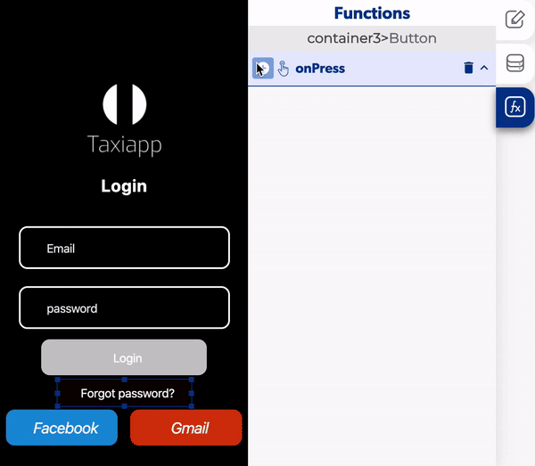

# Forget Password

The forget password is a function in the [users](./) functions which allows to the users change their password by sending a email to the user email, this function is important to the users to secure their account.

### 📥 Entry vars 

* **Email:** select a the text field to provide a way for the user to set his email address.

### ↗ Callbacks 

* **Email not sent:** you can set functions after the app can't send the email.
* **Email sent:** you can set functions after the app send the email.

### 👉 Example. 

#### Forget password

1. Add a forget password in the button.
2. Select an element to fill with a email.
3. Add a [send alert](../notifications/send-alert.md) if the email was send correctly. 

