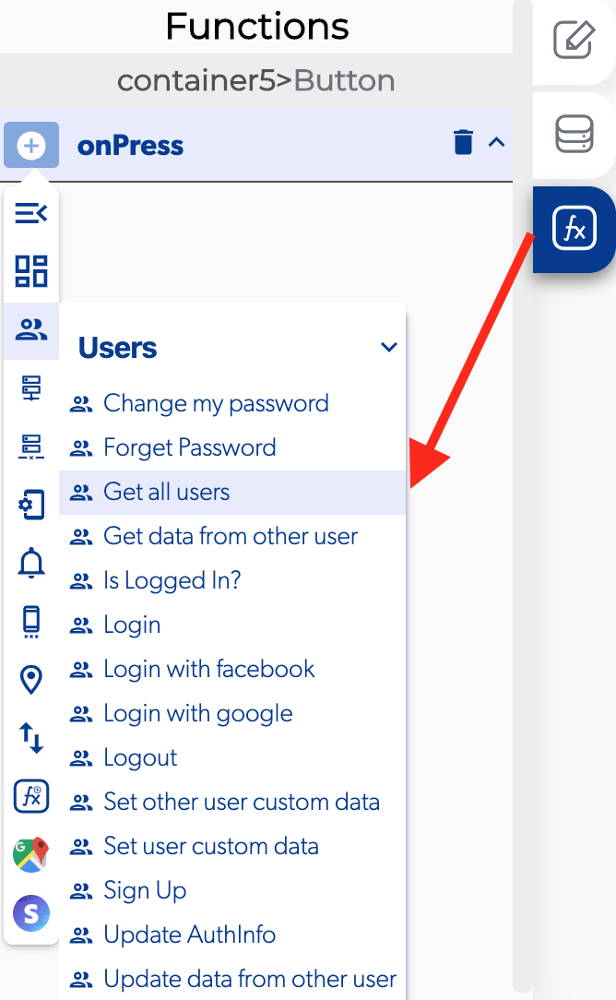

# Get All Users

### ↗ Callbacks 

* **Error retrieving all users:** you can set functions after the app can't retrieving all users from the database.
* **Success retrieving all users:** you can set functions after the app can retrieving all users from the database.

