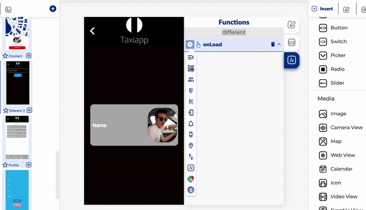
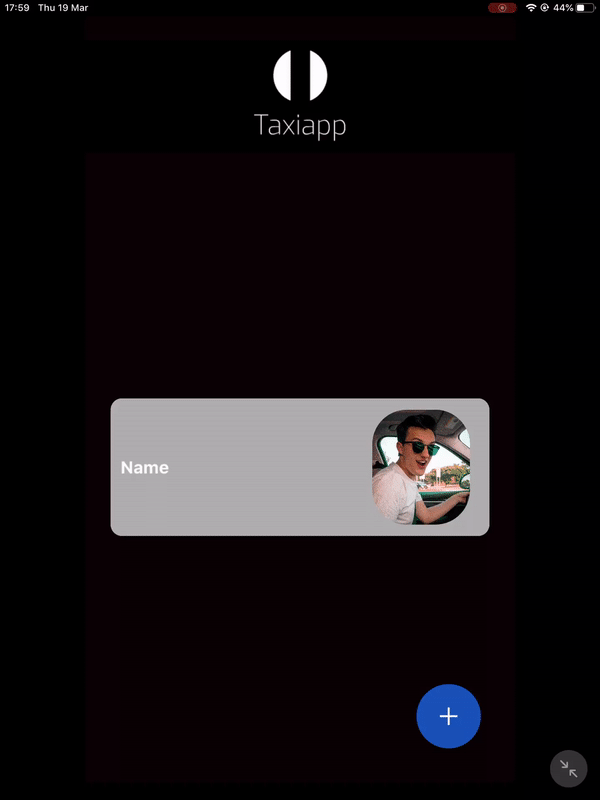

# Get All Users

The get all users is a function in the [users](./) functions which allows to create a list of the register users or get information from users, this function is very useful if the admin need to check or change a status of the actual users of the app.

### ↗ Callbacks 

* **Error retrieving all users:** you can set functions after the app can't retrieving all users from the database.
* **Success retrieving all users:** you can set functions after the app can retrieving all users from the database.

### 👉 Example. 

1. Add a get all user function on the screen using a on load.
2. Activate a [global formater](../logic/global-formater.md) function in the success retrieving all users.
3. Put a previous outputs pressing get all users.
4. Select object in origin type.
5. Select array with ID on target type.
6. Activate an [add collection to UI](../elements/add-collections-to-ui.md) function.
7. Put a previous outputs pressing [global formater](../logic/global-formater.md).
8. Open the modify elements in list instructions.
9. Select the container to change in list settings.
10. Select the element to modify in list data.
11. Select which you need to modify on the control property.
12. Open the list context and write name on the attribute from output.

