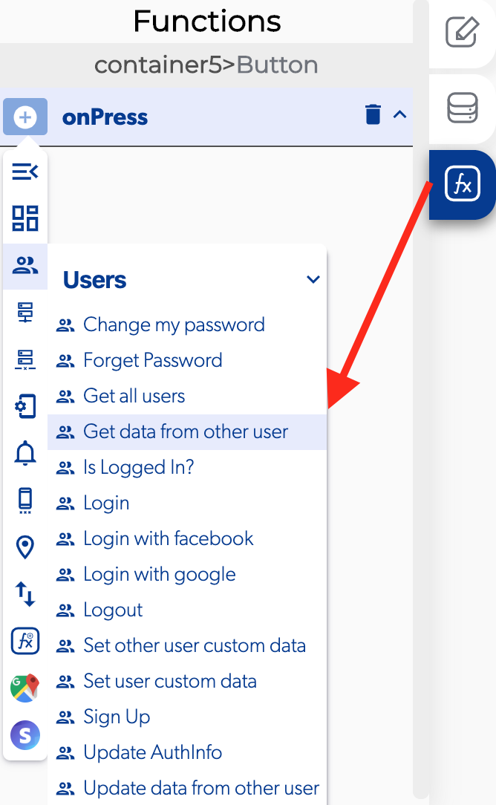

# Get Data From Other User

### 📥 Entry vars 

* **User ID:** Select the specific user ID to get his data.

### ↗ Callbacks 

* **Error retrieving data from user:** You can set functions after the database can't retrieve user data.
* **Success retrieving data from user:** You can set functions after the database can retrieve user data.

