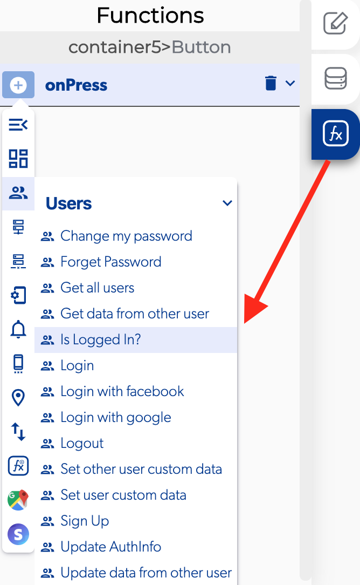
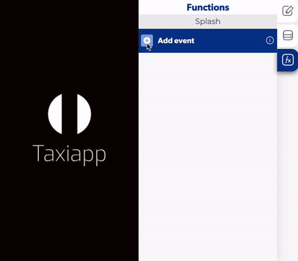

# Is Logged In?

### ↗ Callbacks 

* **User is logged in:** you can set functions or say which screen should be accessible if user is logged.
* **User is not logged in:** you can set functions or say which screen should be accessible if user isn't logged.

### 📤 Out vars 

* **ID current user:** select the specific user ID to get if his is logged or not.

