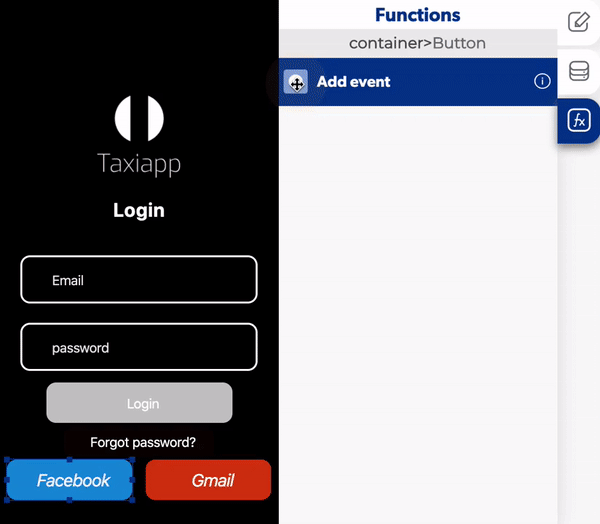

# Login With Facebook

The login with Facebook is a function in the [users](./) functions which allows to the users login by identifying and authenticating themselves with a Facebook account.

### ↗ Callbacks 

* **Error login with facebook \(Title and Subtitle\):** you can set functions after the user can't login to the app with Facebook.
* **Sign in cancelled:** you can set functions after the user can't login to the app with Facebook because he cancel the login.
* **Success login with Facebook:** you can set functions after the user login to the app with Facebook.

1. Select a button to add a login with Facebook function and select on press.
2. Activate a [toggle page loading](../elements/toggle-page-loading.md) and select only enable.
3. Add a login with Facebook function.
4. Add a [toggle page loading](../elements/toggle-page-loading.md) and activate on disable in the success with Facebook login.
5. Activate a [replace screen](../navigation/replace-screen.md) function and select which screen will go after the Facebook login.

\*\*\*\*

