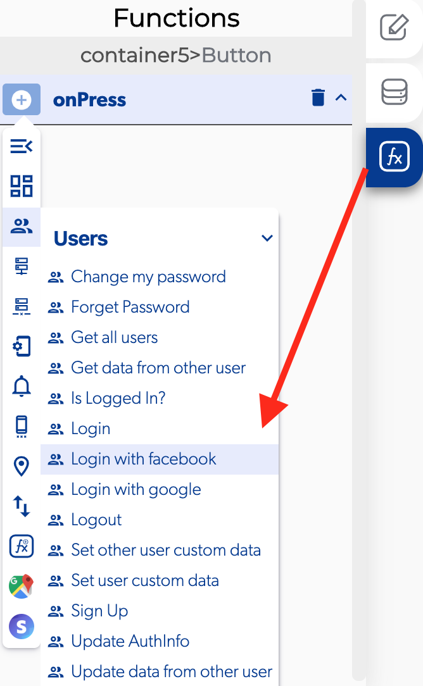

# Login With Facebook

### ↗ Callbacks 

* **Error login with facebook \(Title and Subtitle\):** you can set functions after the user can't login to the app with Facebook.
* **Sign in cancelled:** you can set functions after the user can't login to the app with Facebook because he cancel the login.
* **Success login with Facebook:** you can set functions after the user login to the app with Facebook.

\*\*\*\*

