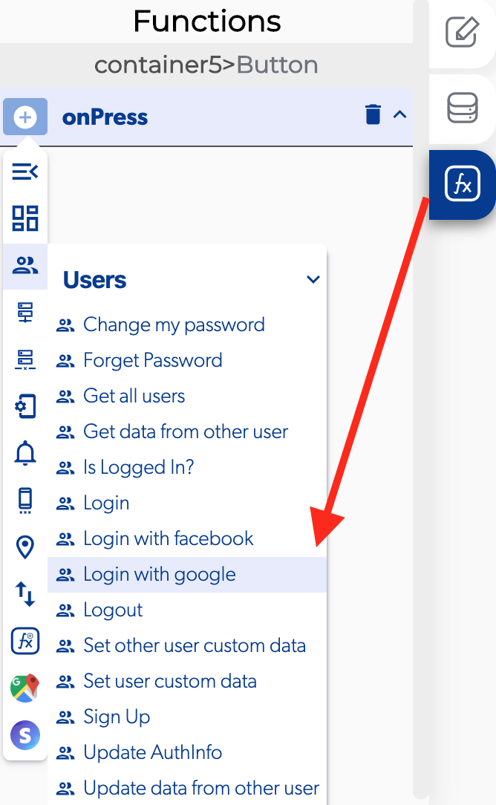

# Login With Google

###  

### 📥 Entry vars 

* **Should always select account**

### ↗ Callbacks 

* **Error login with google**
* **In progress**
* **Play services not available**
* **Sign in cancelled**
* **Successful login wit google**

