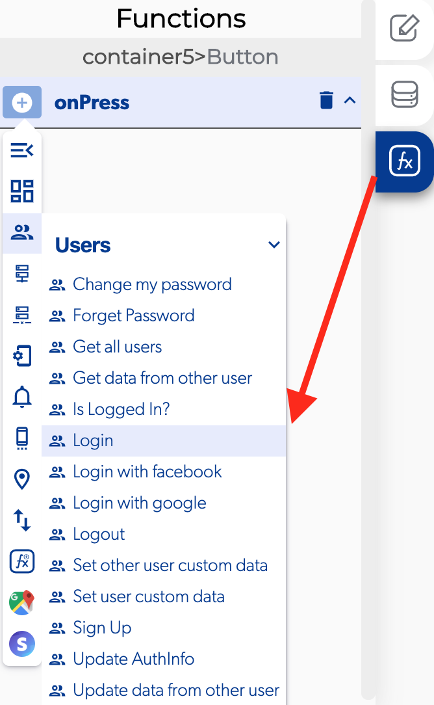

# Login

The login is a function in the [users](./) functions which allows to the users access to the app by identifying and authenticating themselves. The users typically fill forms with a "username and a matching "password".

### 📥 Entry vars 

* **Email:** select a text field to provide a way for the user to set his email.
* **Password:** select a text field to provide a way for the user to set his password.

### ↗ Callbacks 

* **Error login:** you can set functions after the user can't login for a database or app problem.
* **Invalid credentials:** you can set functions after the user can't login because his email or password aren't correct.
* **Successful login:** you can set functions after the user can verify with the app database.

### 👉 Example.  

1. Select the login button and add on press.
2. Add a [toggle page loading](../elements/toggle-page-loading.md) function  and activate only enable.
3. Activate a login function.
4. Select the element email and password.
5. Open the callbacks of the login function and add a toggle page loading on the successful login with and activate the only disable.
6. Add a replace screen and select a screen on the successful login.

