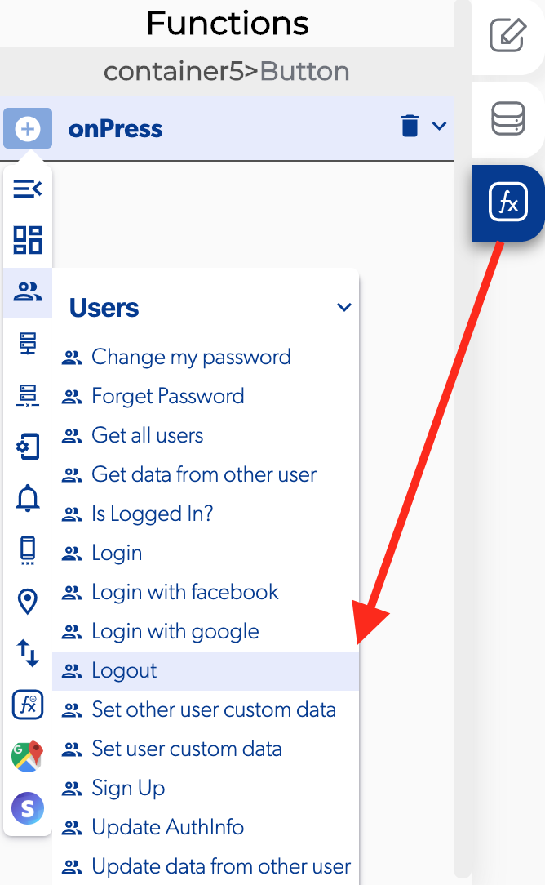
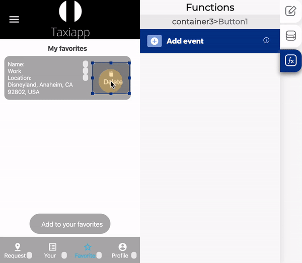

# Logout

### ↗ Callbacks 

* **Error logout:** You can set functions after the user can't log out from the app.
* **Successful logout:** You can set functions after the user log out from the app.

