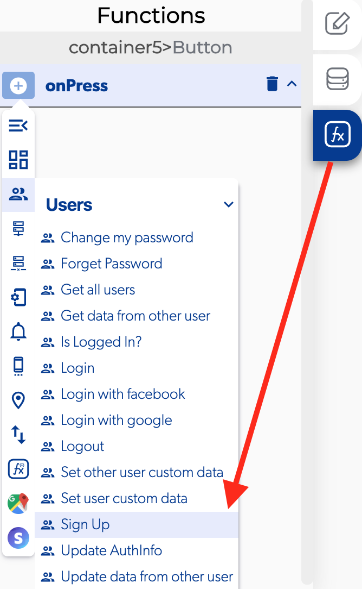
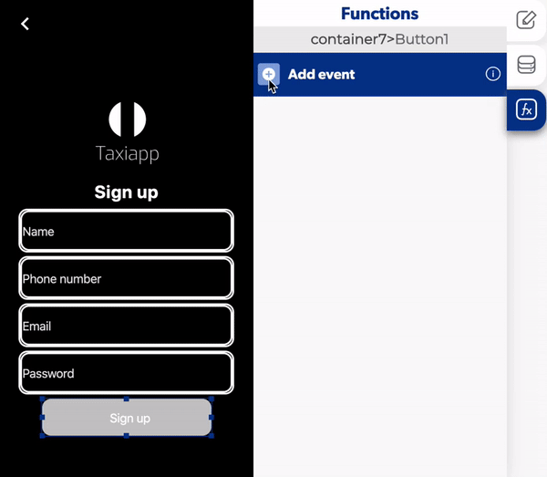

# Sign Up

The Sign up is a function in the [users](./) functions which allows to the users access to the app by register his data. The users typically fill forms with a "username", "password", "phone number" and "email".

### 📥 Entry vars 

* **Email:** select a text field to provide a way for the user to set his email.
* **Name:** select a text field to provide a way for the user to set his name.
* **Password:** select a text field to provide a way for the user to set his password.
* **Phone:** select a text field to provide a way for the user to set his phone.

\*\*\*\*↗ **Callbacks**

* **Error registering:** you can set functions after the user can't register to the app.
* **Success:** you can set functions after the user can register to the app.
* **User is already signed  in:** you can set functions after the user is already sign up in the app.

1. Select the button and activate an on press.
2. Select the element for input the email, name, phone and password.
3. Open the sign up callbacks.
4. Add a [replace screen](../navigation/replace-screen.md) in the user is already signed in.
5. Choose which screen the user will se after sign up. 

