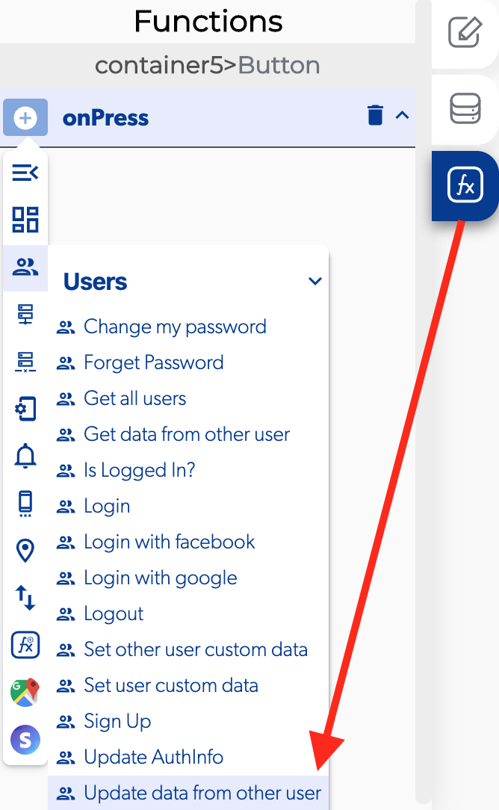

# Update Data From Other User

### 📥 Entry vars 

* **Key**
* **User ID**
* **Value**

\*\*\*\*↗ **Callbacks**

* **Error updating data from other user**
* **Success updating data from other user**

