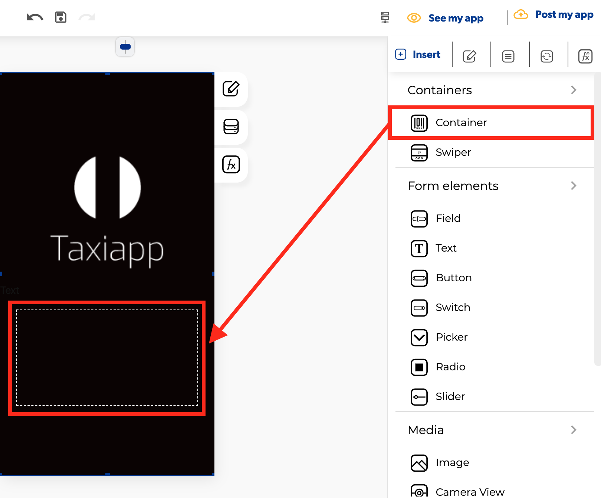

# Container

### ​🎨 Styles  

* **Typography**
  * **Font size:** size of the text that appears on the container element.

    **Appearance**
* * **Background color:** select the background color using the [color picker](../../styles/color-picker.md).
  * **Background image**: this property set one background image for container element.
* **Dimensions**

  * **Width:** set how wide the container element is using.
  * **Height:** set how tall the container element is using.
  * **Height auto:** aligns the dimensions of the containers element  content automatically to the container element.

  \*\*\*\*

* **Layout**
  * **Direction**: specifies the directional flow of the elements inside the container element.
  * **Scroll**:  activate a vertical or horizontal bar commonly located on the far right or bottom of a screen that allows you to move the screen viewing area up, down, left, or right. 
  * **Control z-index:** controls which components display on top of others.Think of the z-direction like it's pointing from the phone into your eyeball. Property sets the z-order of a positioned element and its descendants or flex items. Overlapping elements with a larger z-index cover those with a smaller one. ****
* **Margins**
  * **Padding:** you can specify how much space you want between the border and contents of the container element.
  * **Margin**: you can specify how much space you want between the edges of the container element with the screen or another elements.
* **Shadows**
  * **Presets:** Add a shadow around the container


To set a shadows in a container you need to activate background color or background image.


* **Borders**
  * **Border width:** enter how wide you want the border outline of the container element to be.
  * **Border radius:** enter how round you want the edges of the border for the container element to be.
  * **Border color:** pick a color for the border of the container element.
  * **Border style:** select if you want the border of the container element to be a dotted, dashed or solid line.

### ‌​​⚙ Properties

* **Generic properties**
  * **Control name:** you can add a name to the container element this could be the way to identify this element about another elements.
  * **Enable** [**skeleton loaders**](../../styles/skeleton-loader.md)**:** this tool provides an indication to the user that something is coming but not yet available on the container element.
  * **Control is hidden:** hide the container element from the screen. 
* **Specific Properties**
  * **Split percentage:** Numerical division format example: 25,25,25,25 for a 4 divisions container.
  * **Lock container:** any object inside of the container element cannot be modified and cannot add more elements to the container.

### ​​👆 Events 

* **On press:** the on press event provide the capability to capture tapping gestures and display feedback when this gesture is recognized. 
* **On reach end:** called when all rows have been rendered and the list has been scrolled until the end of the element content.
* **On refresh:** called when the user has dragged the refresh indicator far enough to demonstrate that they want the app to refresh.

### 📝 Writable Properties

* **Background image** 
* **Style height value**
* **Is hidden**
* **Style align item**
* **Style background**
* **Style border color**

