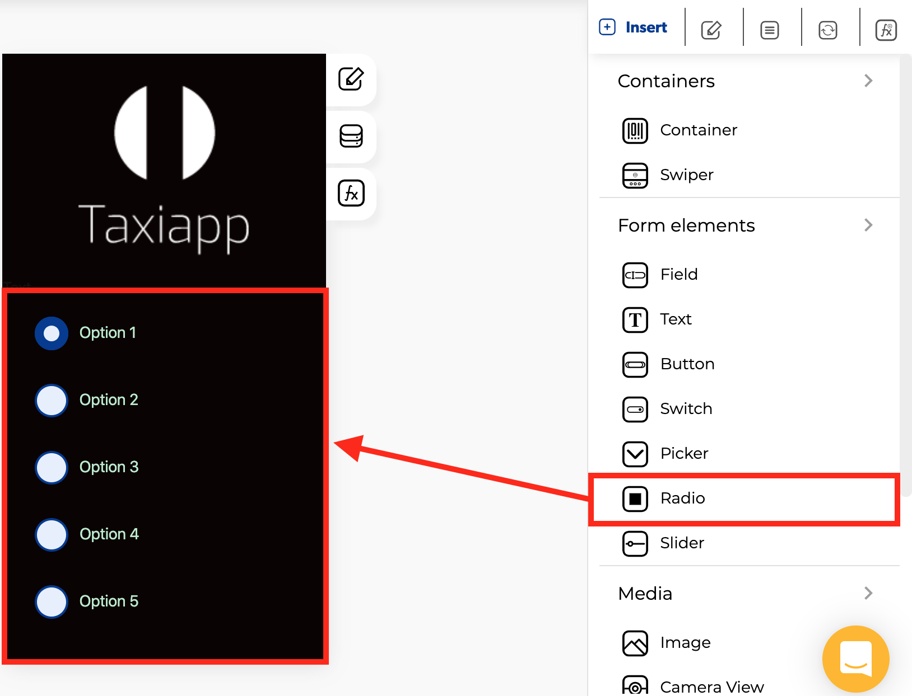

# Radio

### 🎨 Styles 

* **Appearance**
  * Background color
  * Text color
* **Dimensions**
  * Width
  * Height
* Typography
  * Font size
  * Style

### ⚙ Properties

* Radio button basic data
  * Control name
  * Control placeholder
  * Enable dynamic loading
  * Control is hidden
* **List option radio button**
  * Option value

### 👆 Events

* **On charge**

