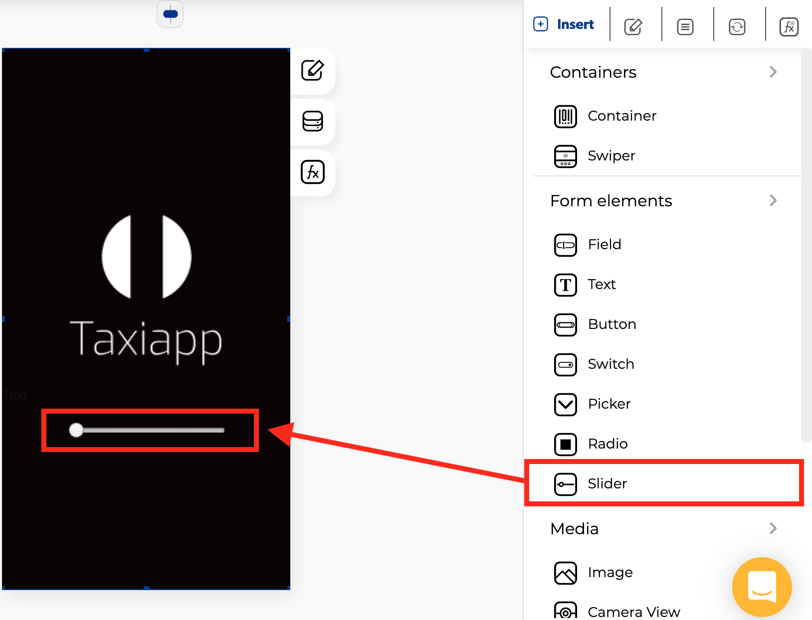

# Slider

### 🎨 Styles

* **Appearance**
  * Thumb color
  * Thumb border color
  * Selection color 
  * Blank color
* **Dimensions**
  * Height
  * Width

### ⚙ Properties

* **Slider basic data**
  * Control name
  * Control is hidden
* **Slider options**
  * Slider minimum value
  * Slider maximum value
  * Slider step

### 👆 Events

* **On charge**

