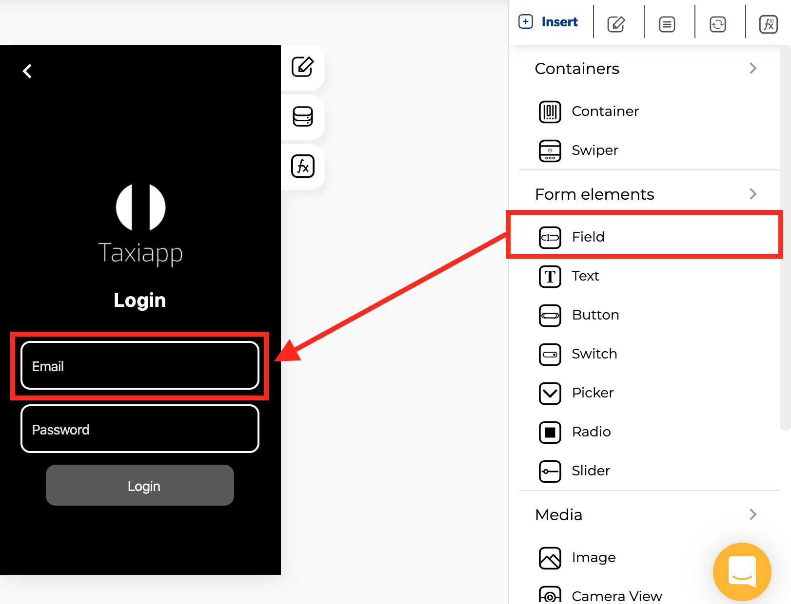

# Text Field

### 🎨 Styles

* **Typography**
  * Font size
* **Appearance**
  * Background color
  * Text color
  * Placeholder color
* **Dimensions**
  * Width
  * Height
* **Margins**
  * Inner margin
  * Outer margin

    \*\*\*\*
* **Borders**
  * Border width
  * Border radius
  * Border color
  * Border style

### ⚙ Properties

* **Text fiel data picker**
  * Enable data picker 
  * Control name
  * Control placeholder
  * Keyboard type
  * Keyboard return key type
  * Enable dynamic loading
  * Enable blur on submit
  * Control is hidden
* **Text field advanced data**
  * Password masking
  * Multi line
  * Input mask
* **Places autocomplete**
  * Enable places autocomplete
* **Button icon**
  * Button icon
  * Direction

### 👆 Events

* **On blur**
* **On charge**
* **On focus**
* **On submit editing**

