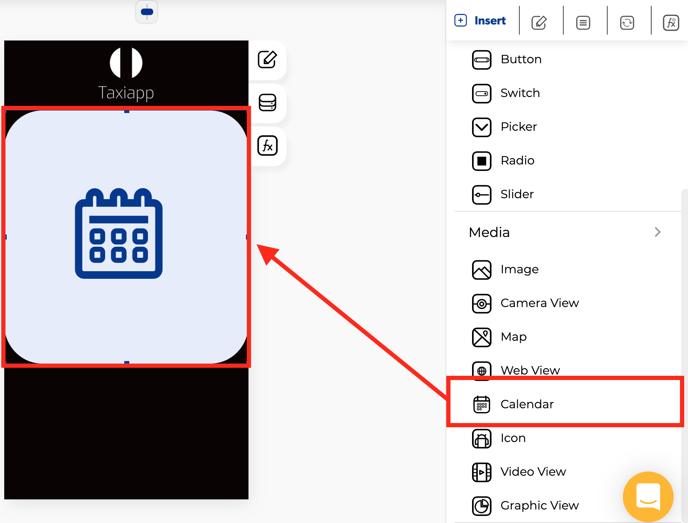

# Calendar

### ⚙ Properties

* **Generic properties**
  * **Enable** [**skeleton loaders**](../../styles/skeleton-loader.md)**:** this tool provides an indication to the user that something is coming but not yet available on the calendar element.
  * **Control is hidden:** hide the calendar element from the screen.


The [**skeleton loader**](../../styles/skeleton-loader.md) component provides a user with a visual indicator that content is coming/loading. This is better received than traditional full-screen loaders.


### 👆 Events

* **On charge:** the on charge ****event detects when the value of a calendar element changes. 

