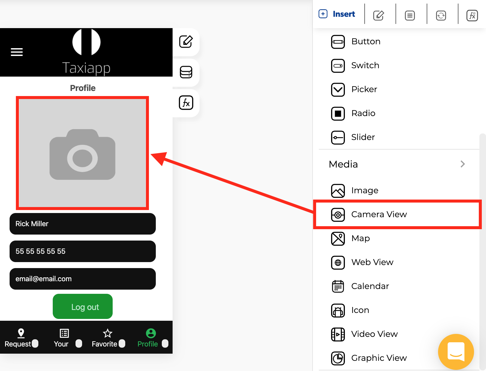

# Camera View

### ⚙ Properties

* **Generic properties**
  * **Enable** [**skeleton loaders**](../../styles/skeleton-loader.md)**:** this tool provides an indication to the user that something is coming but not yet available on the camera view element.
  * **Control is hidden:** hide the camera view element from the screen.


The [**skeleton loader**](../../styles/skeleton-loader.md) component provides a user with a visual indicator that content is coming/loading. This is better received than traditional full-screen loaders.


### 👆 Events

* **On QR code read:** implements a view which show camera and notify when there's a QR code inside the preview.
* **On take picture:** called when image data is available after a picture is taken.

