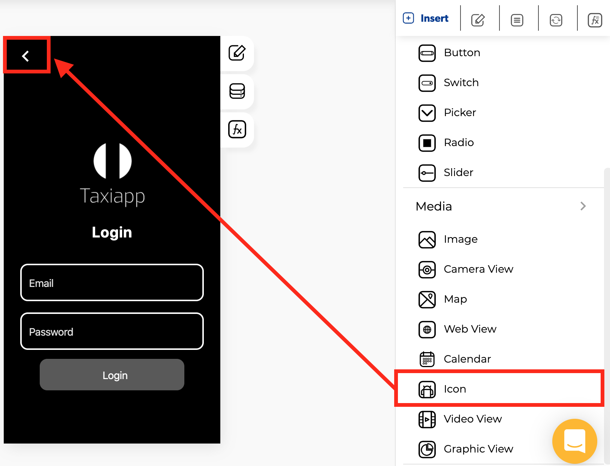

# Icon

### 🎨 Styles 

* **Typography**
  * Font size
* **Appearance**
  * Text color
* **Margins**
  * Outer margin

### ⚙ Properties

* **Icon** 
  * Control name
  * Icon picker
  * Keyboard type
  * Enable dynamic loading
  * Control is hidden
* **Badge options**
  * Enable icon badge
  * Background color
  * Text color
  * Badge text

### 👆 Events

* **On press**

