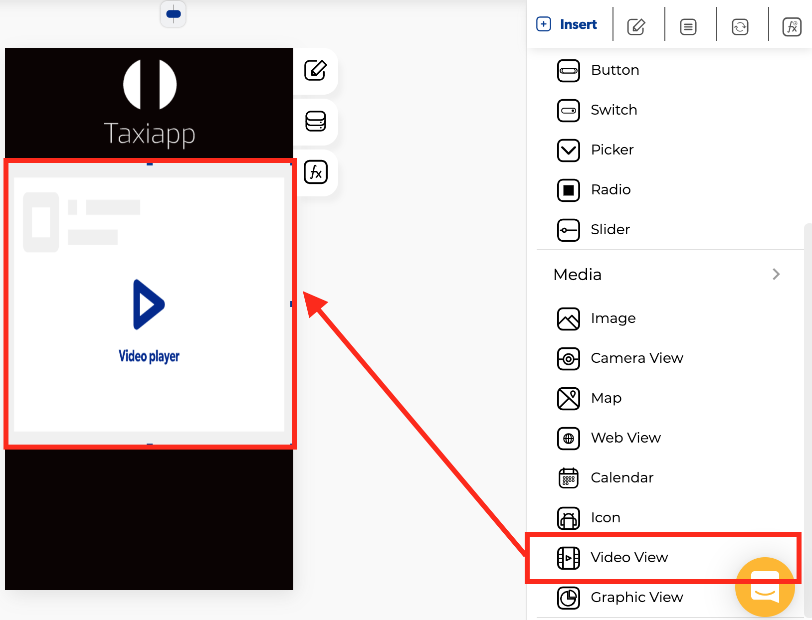

# Video View

### 🎨 Styles 

* **Dimensions**
  * **Width:** set how wide the video view element is using.
  * **Height:** set how tall the video view element is using.

### ⚙ Properties

* **Generic properties**
  * **Enable** [**skeleton loaders**](../../styles/skeleton-loader.md)**:** this tool provides an indication to the user that something is coming but not yet available on the video view element.
  * **Control is hidden:** hide the video view element from the screen.
* **Specific properties**
  * **Video URL:** The URL is the address of a video. You can find it in the address bar on the top of your top web browser. Alternatively, you can find the URL for a link by right-clicking it and copying the link. 


The video view element only allows YouTube and Vimeo Url with https:// **example**: [https://www.youtube.com/watch?v=ybGWhmglHJQ](https://www.youtube.com/watch?v=ybGWhmglHJQ)


